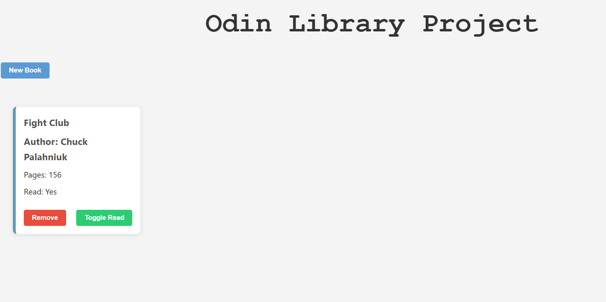

# 📚 Odin Library App

A simple digital library app built with **HTML, CSS, and JavaScript** as part of [The Odin Project](https://www.theodinproject.com/)'s curriculum. Users can add books they've read (or want to read), mark them as read/unread, and remove them from the collection.

---

## ✨ Features

- 📖 Add books with title, author, page count, and read status
- ✅ Toggle read/unread status with a single button
- 🗑️ Remove books from your library
- 🎨 Clean UI with responsive card-based layout
- 📦 All data stored in-memory (array), no backend or localStorage used

---

## 🚀 Demo

  
*Note: Replace the above link with an actual image URL if you upload a screenshot to your repo.*

---

## 🛠️ Tech Stack

- **HTML5**
- **CSS3** – Flexbox, Grid, and Modal styling
- **Vanilla JavaScript** – DOM manipulation, constructor functions, array handling

---

## 📂 Project Structure

---

## 📸 Screenshots

---

## 🎯 Goals

- Practice JavaScript object constructors
- Gain experience with DOM manipulation
- Learn to organize code for maintainability
- Apply problem-solving to build features incrementally

---

## ✅ Status

✔️ Completed  
📅 Last updated: April 20, 2025

---

## 🧠 What I Learned

- Constructing and managing objects in JavaScript
- Handling DOM events and updating the UI dynamically
- Using array methods like `push()` and `splice()`
- Styling with Flexbox and CSS Grid
- Debugging with the browser console and correcting DOM errors

---

## 🔗 Live Preview

Coming soon via GitHub Pages or another host!

---

## 🙌 Acknowledgements

- Thanks to [The Odin Project](https://www.theodinproject.com/) for this great assignment and curriculum
- Used [MDN Docs](https://developer.mozilla.org/) and personal notes for DOM API references

---

## 📘 License

This project is licensed under the MIT License.
